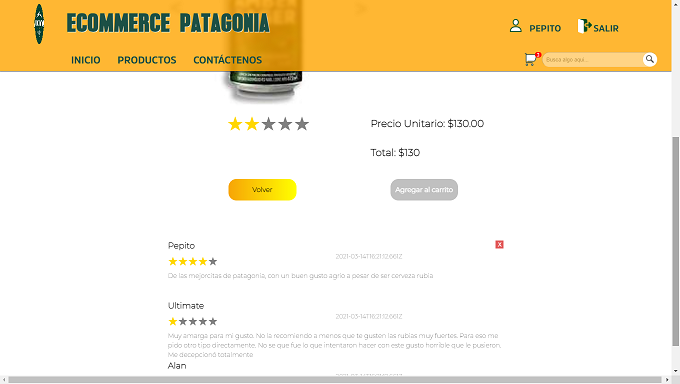
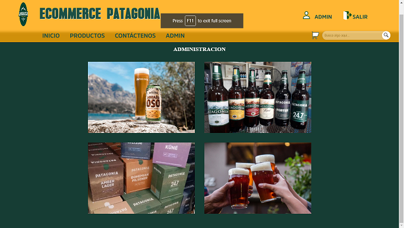

    

# Henry

This project was done as part of Henry’s educational bootcamp.

## Objetives

- Built a Javascript App from zero.
- Strengthen the concepts studied during the past 2 months.
- Learn good coding practices.
- Learn git workflow.
- Learn Scrum method.
- Work as a team..

## FEATURES

### Guest Users

Guest can work with the app. They have access to:

- PRODUCTS:

- SHOPPING CART:

- ACCOUNT CREATION:

### Created Users

As a user you have access to:

- PROFILE:

- REVIEWS:

### Admin

As an admin you can rune the site, list available items, orders, users and categories.

- CONTROL PANEL:

- ORDERS PANEL:

- USERS PANEL:

## Technologies Used

- React
- Redux
- Axios
- PostgresQL
- Sequelize
- NodeJs
- Express
- Bcrypt
- Passport
- Mailgun
- JsonWebToken
- Multer

## CONTRIBUTORS

- [Alan Casella](https://github.com/AlanCasella)
- [Marcelo Spagnuolo](https://github.com/MarceloSpagnuolo)
- [Daniel Ignacio Nieto](https://github.com/Daniel-Ignacio-Nieto)
- [Eliezer Salazar](https://github.com/babinobass)
- [David Alvarez](https://github.com/aalvag)

[Visit](https://ecommerce-patagonia.vercel.app/)
