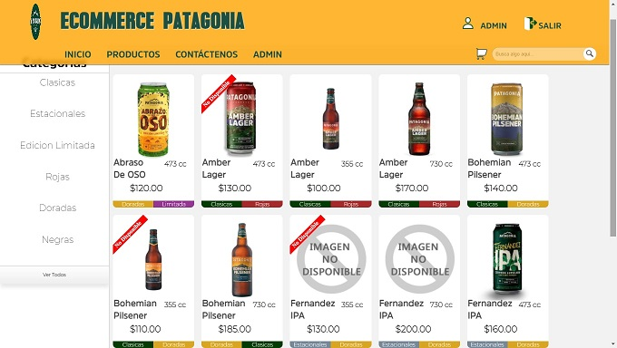
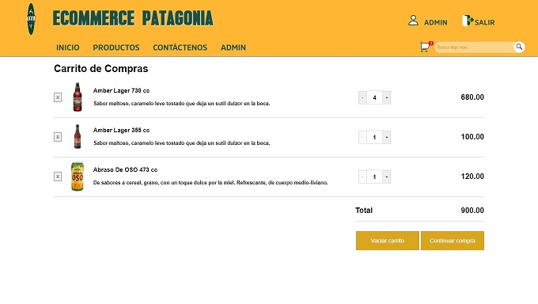
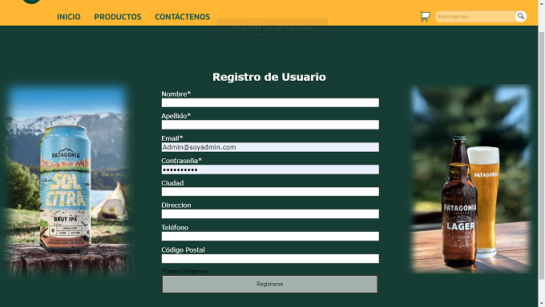
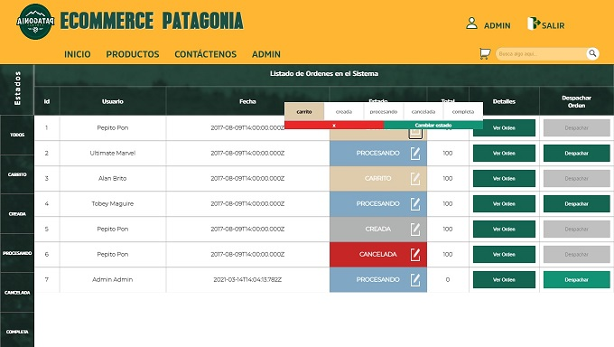

<p align='left'>
    
</p>

# Henry

## Objetivos del Proyecto

- Construir una App JavaScript desde cero.
- Afirmar y conectar los conceptos aprendidos en la carrera.
- Aprender mejores prácticas.
- Aprender y practicar el workflow de GIT.
- Utilizar Metodologías Ágiles.
- Trabajar en equipo.

## BoilerPlate

El boilerplate cuenta con dos carpetas: `api` y `client`. En estas carpetas estará el código del back-end y el front-end respectivamente.

En `api` vas a tener que crear un archivo llamado: `.env` que tenga la siguiente forma:

```
DB_USER=usuariodepostgres
DB_PASSWORD=passwordDePostgres
DB_HOST=localhost
```

Tenés que reemplazar `usuariodepostgres` y `passwordDePostgres` con tus propias credenciales para conectarte a postgres. Este archivo va ser ignorado por github, ya que contiene información sensible (las credenciales).

El contenido de `client` fue creado usando: Create React App.

## FEATURES

### Usuarios no Autenticados

Un Visitante anónimo debería poder navegar tu e-commerce, ver y buscar productos.

Como un Guest podrás acceder a...

- PRODUCTOS:




- CARRITO:



- GESTION DE CUENTA:



### Usuarios Autenticados

###### Como un Usuario Autenticado podrás acceder a...

- GESTION DE CUENTA:
- REVIEWS:

### Admin

Los usuarios administradores pueden manejar el sitio, los productos que se listan y los items que están disponibles.

###### Como un administrador yo quiero...

- GESTION DE PRODUCTOS:


- GESTION DE ORDENES:



- GESTION DE USUARIOS:

### Validación de Datos

Cuando crees los modelos, debes considerar los tipos de datos que vas a recibir, qué cosas van a ser requeridas y cómo vas a devolver los errores a los usuarios.
Algunas constrains qué deberás implementar:

- Productos:
- Usuarios:
- Ordenes:
- Reviews:

## CONTRIBUTORS

- [Alan Casella](https://github.com/AlanCasella)
- [Marcelo Spagnuolo](https://github.com/MarceloSpagnuolo)
- [Daniel Ignacio Nieto](https://github.com/Daniel-Ignacio-Nieto)
- [Eliezer Salazar](https://github.com/babinobass)
- [David Alvarez](https://github.com/aalvag)